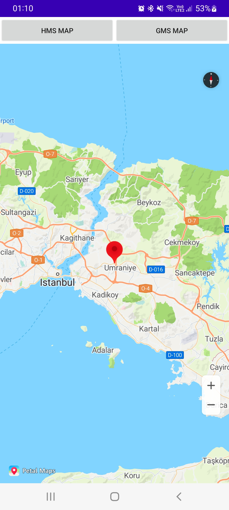

<h1 align="center">Google MAPS and Huawei MAPS APP</h1>

<ul>
  <li>HMS stands for Huawei Mobile Services</li>
  <li>GMS stands for Google Mobile Services</li>
</ul>
Automatically Switch between HMS or GMS Map based on phone via IF/ELSE (Kotlin)

|||

Huawei P20 Pro (GMS+HMS) Samsung Galaxy A32(GMS+HMS) 

Author
👤 Ferhat OZCELIK

Github: @ferhatozcelik
LinkedIn:https://www.linkedin.com/in/ferhatozcelik/
Show your support
Give a ⭐️ if this project helped you!

📝 License
Copyright © 2022 Ferhat OZCELIK.
This project is Apache License, Version 2.0 (the "License") licensed.